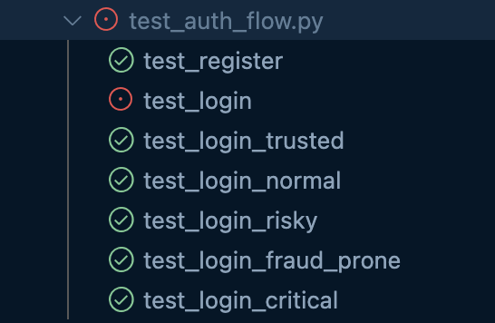

# User Login & Score Classification Test Cases Report

## Overview

This document describes the test cases designed to verify the user registration, login, and score-based classification system. The tests check that users receive the correct trust level flag and warnings according to their score upon login.

### Where are the test cases?

```
└── tests
    ├── __init__.py
    ├── conftest.py
    ├── scenarios
        ├── test_auth_flow.py
        ├── test_suspicious_flow.py
        └── test_txn_flow.py
 
```

- `test_auth_flow.py`: Contains tests related to user registration, login flows, and score classification.

---

## Test Cases

### 1. User Registration Test

- **Purpose:** Verify that a new user can register successfully and the response contains correct user details with HTTP status 201.
- **Scenario:**
  - Send a POST request to register a new user with default score 100.
  - Expect HTTP 201 response.
  - Check the success message and user’s first and last name in the response.

#### Result: Passed

---

### 2. Login Test for Trusted User (score ≥ 90)

- **Purpose:** Verify that a user with a score of 90 or above is classified as "Trusted" during login with no warnings.
- **Scenario:**
  - Create a user with score 90.
  - Perform login request with mocked device info.
  - Expect response to include score 90, flag "Trusted", and no warning message.

#### Result: Passed

---

### 3. Login Test for Normal User (score 75–89)

- **Purpose:** Verify that a user with a score between 75 and 89 is classified as "Normal" and receives a transaction limit warning.
- **Scenario:**
  - Create a user with score 80.
  - Login with mocked device data.
  - Expect response with flag "Normal" and warning:  
    `"You can make transactions up to €5,000 in 3 months"`.

#### Result: Passed

---

### 4. Login Test for Risky User (score 50–74)

- **Purpose:** Verify that a user with score between 50 and 74 is classified as "Risky" and warned about transaction limits.
- **Scenario:**
  - Create a user with score 60.
  - Login user.
  - Expect flag "Risky" and warning:  
    `"You can make up to 3 transactions over €1,000 in 1 month"`.

#### Result: Passed

---

### 5. Login Test for Fraud Prone User (score 30–49)

- **Purpose:** Verify that users scoring between 30 and 49 are classified as "Fraud Prone" with specific transaction restrictions.
- **Scenario:**
  - Create a user with score 40.
  - Login user.
  - Expect flag "Fraud Prone" and warning:  
    `"You can make up to 10 transactions per month, each under €100"`.

#### Result: Passed

---

### 6. Login Test for Critical User (score < 30)

- **Purpose:** Verify that a user with score below 30 is classified as "Critical" and blocked from login with an error message.
- **Scenario:**
  - Create a user with score 20.
  - Attempt login.
  - Expect HTTP 403 response with error field:  
    `"Account is locked. Identity verification required"`.

#### Result: Passed

---
# Final result

**All test cases passed!**



> ⚠️ **Note:**  
> The function `test_login` is **not** a test case by itself; it serves as a **blueprint/helper** function for the other specific login tests (`test_login_trusted`, `test_login_normal`, etc.).


- [x] User register feature
- [x] User login feature
- [x] User message based on score and level

---

## How to Run the Tests

1. Ensure the backend API and dependent services (MongoDB, Redis, Neo4j) are running.
2. Run the tests using your preferred test runner or execute `pytest tests/test_auth_flow.py`.

---

## Notes

- These tests use mock device logs with randomized MAC addresses and IPs.
- Tests check HTTP status, JSON response fields (`score`, `flag`, `warning`, `error`).
- The scoring thresholds and warning messages are configurable on the backend.

---

If you have any questions or want to discuss the test scenarios in more detail, feel free to ask!
