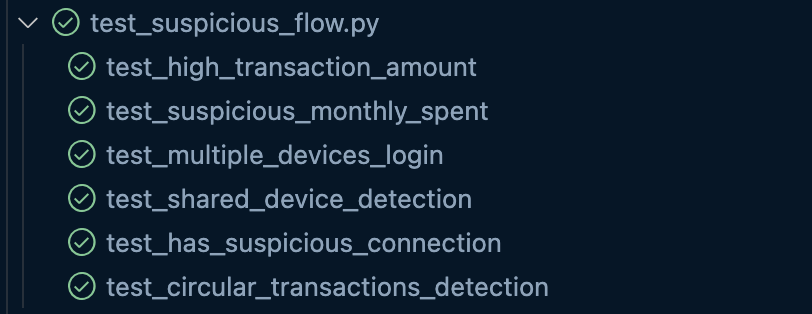

# User Score Calculation Test Cases Report

## Overview

This document describes the test cases created to verify the user scoring system based on various criteria related to login behavior, device usage, transactions, and user relationships.

### Where are the test cases?

```
└── tests
    ├── __init__.py
    ├── conftest.py
    ├── scenarios
        ├── test_auth_flow.py
        ├── test_suspicious_flow.py
        └── test_txn_flow.py
 
```


- `test_suspicious_flow.py`: Tests covering suspicious activity detection, and score calculating

---

## Test Cases

### 1. Multiple Devices Login Test

- **Purpose:** Verify that if a user logs in using more than 5 different devices, their score is penalized and the reason `"has_multiple_devices"` is returned.
- **Scenario:**
  - Register a new user with an initial score of 100.
  - Simulate the user logging in from 6 different devices (different MAC addresses and IPs).
  - Call the score calculation API.
  - Expect the score to be decreased (e.g., 80) and the reason `"has_multiple_devices"` included in the response.

#### Result: Passed

### 2. Shared Device Detection Test

- **Purpose:** Check if more than 5 different users share the same device (device_id), the user is penalized with the reason `"has_multiple_devices"`.
- **Scenario:**
  - Register 5 different users and have them all log in using the same device.
  - Register one more user who also logs in from that same device.
  - Call the score calculation API for the sixth user.
  - Expect the reason `"has_multiple_devices"` and a reduced score.

#### Result: Passed
### 3. Suspicious Connections Test


- **Purpose:** Detect if a user has more than 3 connections to users with scores below 50, then the user’s score is penalized with the reason `"suspicious_connections"`.
- **Scenario:**
  - Register the main user and multiple low-score users (<50).
  - Create transactions (relationships) between the main user and these suspicious users.
  - Call the score calculation API.
  - Expect the reason `"suspicious_connections"` and a lower score.
#### Result: Passed
### 4. Circular Transactions Test

- **Purpose:** Detect circular transactions within the user network (e.g., user1 sends to user2, user2 to user3, user3 to user4, and user4 back to user1).
- **Scenario:**
  - Register 4 users.
  - Create transactions forming a loop: user1 → user2 → user3 → user4 → user1.
  - Call the score calculation API for user1.
  - Expect the reason `"circular_transactions"` and a decreased score.
#### Result: Passed

---
# Final result

**All test cases passed!**



- [x] Suspicious detection flow
- [x] Score calculating flow


---

## Technical Details

- **Core logic functions:**
  - `has_multiple_devices(user_id)`: Checks if the user logged in with more than 5 devices.
  - `has_shared_device_count(user_id, device_id)`: Checks if the device is shared by more than 5 different users.
  - `has_suspicious_connections(user_id)`: Checks if the user connects to more than 3 low-score users.
  - `has_circular_transactions(user_id)`: Detects if there is a circular transaction path involving the user.

- **Backend stack:**
  - MongoDB stores user info, device logs, transaction records.
  - Neo4j stores and queries relationships between users and transactions.
  - REST API endpoint `/score/calculate` returns the updated score and penalty reasons.

- **Testing utilities:**
  - `register_user()` to create test users.
  - `create_transaction()` to simulate transactions.
  - Use HTTP requests to call the scoring API.
  - Assert expected JSON response fields.

---

## How to Run the Tests

1. Ensure backend services (API, MongoDB, Neo4j) are running and accessible.
2. Run the test functions individually or as a test suite.

---

## Recommendations

- Make sure Neo4j data correctly reflects transactions to effectively test circular transaction detection.
- Handle edge cases like non-existent users or devices gracefully.
- Extend tests to cover additional scoring rules as the system evolves.

---

If you have any questions regarding the flow and the test cases, I will be happy to discuss with you!

