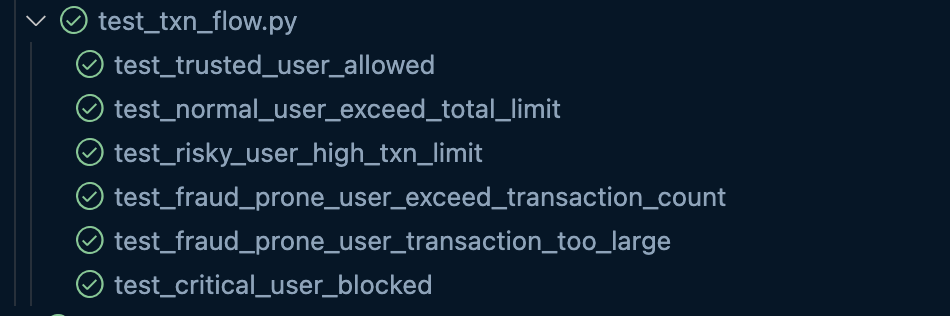

# Report: User Transaction Policy Test Cases

## Overview

This document describes the test cases created to verify the enforcement of transaction policies based on users' trust scores. Each trust level has specific transaction limits or restrictions applied.

### Where are the test cases?

```
└── tests
    ├── __init__.py
    ├── conftest.py
    └── scenarios
        └── test_txn_flow.py
```


- `test_txn_flow.py`: Contains tests for transaction limits and restrictions according to user trust scores (Trusted, Normal, Risky, Fraud-prone, Critical).

---

## Test Cases

### 1. Trusted User Allowed Test

- **Purpose:** Verify that a user with a high trust score (≥90) can perform large transactions without restrictions.
- **Scenario:**
  - Register a user with a score of 95 (Trusted user).
  - Perform a large transaction (e.g., 99,999€).
  - Expect the transaction to succeed with HTTP status 200.

#### Result: Passed

---

### 2. Normal User Exceed Total Limit Test

- **Purpose:** Check that a Normal user (score 75–89) is limited to a total transaction amount of 5,000€ over 3 months.
- **Scenario:**
  - Register a user with score 80.
  - Perform two transactions totaling 4,800€ within 3 months.
  - Attempt a third transaction that causes the total to exceed 5,000€.
  - Expect the last transaction to be blocked with HTTP status 403 and an error message indicating the limit exceeded.

#### Result: Passed

---

### 3. Risky User High Transaction Limit Test

- **Purpose:** Ensure that a Risky user (score 50–74) is limited to at most 3 transactions over 1,000€ per month.
- **Scenario:**
  - Register a user with score 60.
  - Perform 3 transactions greater than 1,000€ each within a month.
  - Attempt a 4th transaction above 1,000€.
  - Expect the 4th transaction to be blocked with HTTP status 403 and an error mentioning "Max 3 transactions".

#### Result: Passed

---

### 4. Fraud-Prone User Exceed Transaction Count Test

- **Purpose:** Verify that a Fraud-prone user (score 30–49) cannot exceed 10 transactions per month.
- **Scenario:**
  - Register a user with score 40.
  - Perform 10 transactions within one month.
  - Attempt an 11th transaction.
  - Expect the 11th transaction to be blocked with HTTP 403 and an error message about exceeding "Max 10 transactions per month".

#### Result: Passed

---

### 5. Fraud-Prone User Transaction Amount Limit Test

- **Purpose:** Ensure a Fraud-prone user (score 30–49) cannot perform any transaction exceeding 100€.
- **Scenario:**
  - Register a user with score 35.
  - Attempt to perform a transaction greater than 100€.
  - Expect the transaction to be blocked with HTTP 403 and an error message "Max €100 per transaction".

#### Result: Passed

---

### 6. Critical User Blocked Test

- **Purpose:** Confirm that a Critical user (score below 30) is completely blocked from making any transactions.
- **Scenario:**
  - Register a user with score 10.
  - Attempt any transaction.
  - Expect the transaction to be blocked with HTTP 403 and an error message "Account is locked".

#### Result: Passed

---

## Final Result

**All test cases passed successfully!**



- [x] Determine level based on trust score
- [x] Implement limitations based on level

---

## Technical Details

- **Key functions tested:**
  - Enforcement of transaction limits and counts based on user trust scores.
  - Proper HTTP status codes and error messages returned when limits are exceeded.
  
- **Testing tools:**
  - `register_user()` to create users with specific trust scores.
  - `create_transaction()` to simulate transactions between users.
  - Assertions on HTTP response codes and returned error messages.

---

## How to Run the Tests

1. Ensure the backend API and dependent services (MongoDB, Neo4j) are running.
2. Execute the tests using `pytest` or your preferred test runner.

---

## Recommendations

- Make sure the Mongo database is empty before the tests
- Extend tests to cover edge cases such as boundary scores (e.g., exactly 75 or 50).
- Add tests for concurrency and simultaneous transactions.
- Regularly update tests if policy thresholds or logic change.

---

If you have any questions or want to discuss the test logic and coverage, feel free to ask!

